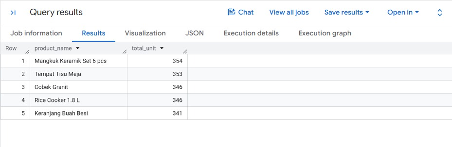
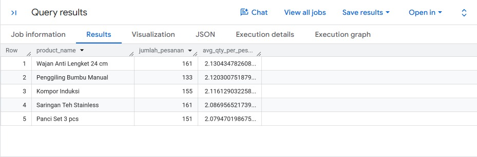
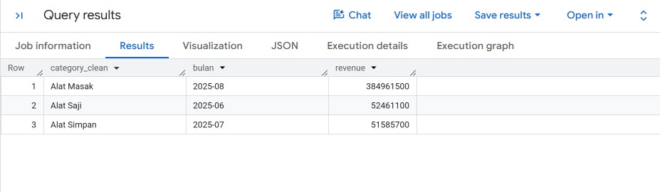

# 📊 E-Commerce Sales Analysis using SQL & Google BigQuery

## 📌 Project Overview

This project analyzes an e-commerce sales dataset using SQL in Google BigQuery. The analysis answers several business questions related to sales performance, shipping costs, customer purchasing behavior, and refund rates.

The project demonstrates practical SQL skills commonly used by Data Analysts to transform raw transaction data into actionable business insights.

---

## 🎯 Objectives

- Analyze sales performance using SQL
- Identify top-selling products by quantity and revenue
- Evaluate shipping cost differences across cities
- Measure refund performance
- Analyze customer purchasing behavior
- Apply analytical SQL techniques using Google BigQuery

---

## 🛠️ Tools & Technologies

- Google BigQuery
- SQL (Standard SQL)
- Google Cloud Platform (GCP)

---

## 📂 Business Cases

| No | Business Case |
|----|---------------|
| 1 | Calculate Total and Average Shipping Cost |
| 2 | Top 5 Products by Units Sold |
| 2 | Top 5 Products by Revenue |
| 3 | Completed Orders and Revenue in Q4 2025 |
| 4 | Compare Average Shipping Cost by City |
| 5 | Refund Percentage Analysis |
| 6 | Top Products by Average Quantity per Order |
| 7 | Best Sales Month by Product Category |
| 8 | Pareto 80% Revenue Analysis |
| 9 | Customer Purchase Interval Analysis |
| 10 | Product Refund Rate Analysis |

---
## 📸 Sample Query Results

The following screenshots present sample outputs from selected SQL business case analyses performed using Google BigQuery.

### Business Case 02 – Top 5 Products by Units Sold



### Business Case 06 – Refund Percentage Analysis



### Business Case 07 – Top Products by Average Quantity per Order


---
## 📊 Sales Performance Dashboard

In addition to the SQL business case analyses, I developed an interactive sales performance dashboard using **Looker Studio** based on the **Kitchen Equipment Sales (`order_test`)** dataset from Google BigQuery. The dashboard answers different business questions and demonstrates how raw data can be transformed into meaningful business insights through data visualization.

### Dashboard Preview


### Interactive Dashboard

🔗 **View Dashboard:** https://datastudio.google.com/reporting/4fbb5a67-5de9-4191-8ae0-fb5bfd15f9e6

---
## 💡 SQL Skills Demonstrated

- SELECT
- WHERE
- GROUP BY
- ORDER BY
- HAVING
- Aggregate Functions
- CASE WHEN
- Common Table Expressions (CTE)
- Window Functions
- ROW_NUMBER()
- LAG()
- COUNTIF()
- SAFE_DIVIDE()
- DATE_DIFF()
- FORMAT_DATE()

---

## 📁 Repository Structure

```
ecommerce-sales-analysis-sql-bigquery
│
├── README.md
├── sql_queries
│   ├── 01_total_shipping_cost.sql
│   ├── 02_top_products_by_unit.sql
│   ├── 02_top_products_by_revenue.sql
│   ├── ...
│   └── 10_product_refund_rate_analysis.sql
│
└── screenshots
```

---

## 👩‍💻 Author

**Matlubatul Masquroh**

Graduate of Digital Telecommunication Network Engineering

Interested in Data Analytics, Business Intelligence, and SQL.
